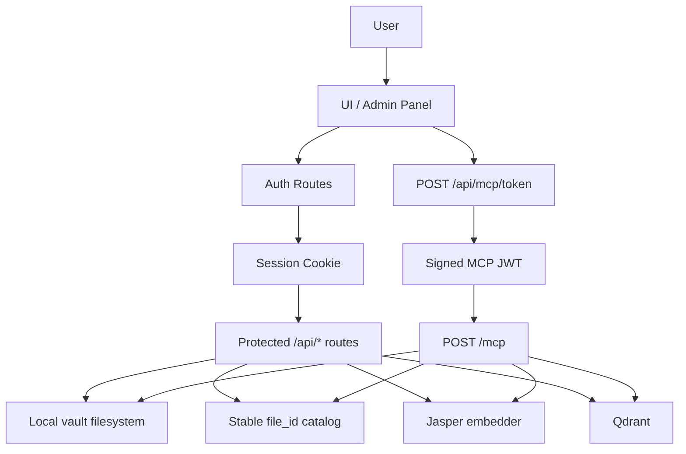
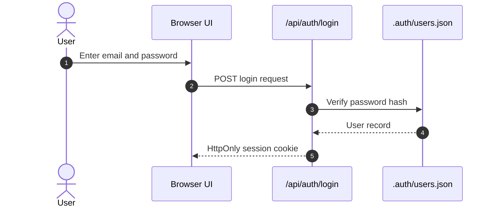
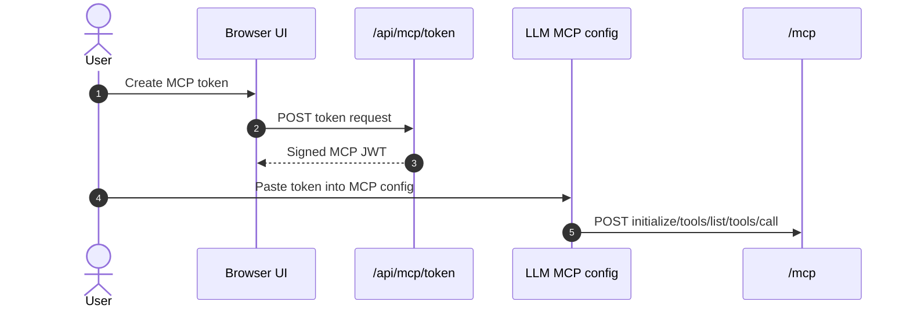
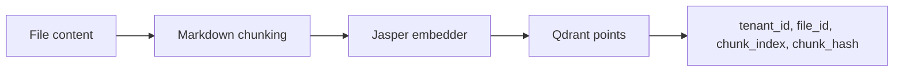
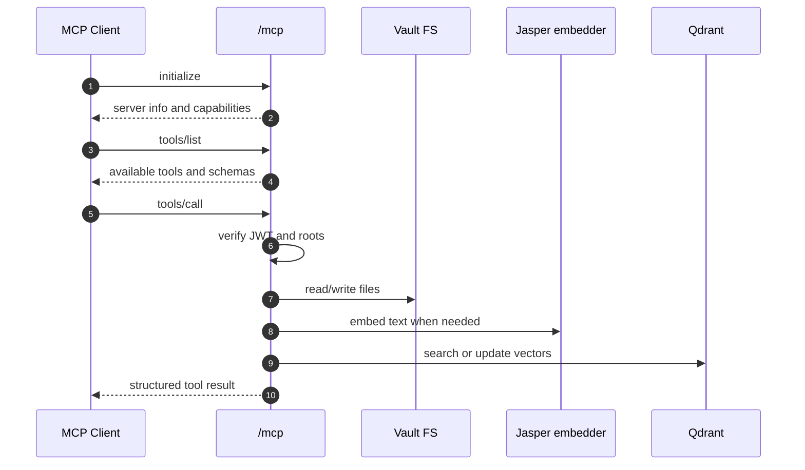
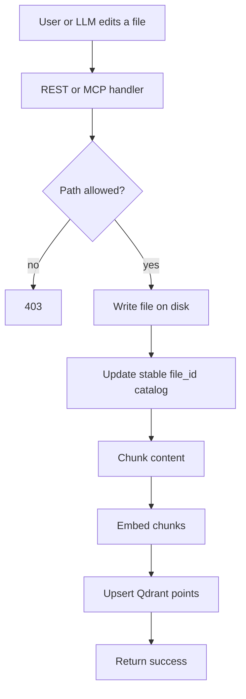
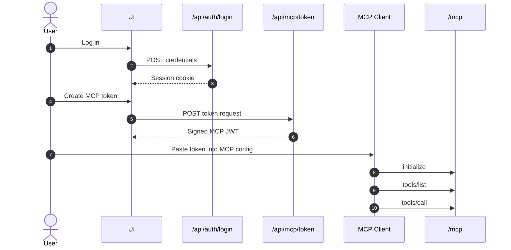

# brAIn.md MCP Server

This repository implements the backend for a local-first note and vault system that is split into two clear surfaces:

- `/api` for the human-facing backend used by the UI
- `/mcp` for the model-facing JSON-RPC transport used by an LLM client

The system is intentionally built around a local filesystem vault, not a database-backed document store. The filesystem is the source of truth. Qdrant stores vectors and metadata references. The app keeps stable `file_id` identifiers so file paths can move without invalidating vector references.

## What Is Implemented

The current backend includes:

- User authentication for the backend API
- Session-based login, logout, and session lookup
- Protected REST endpoints for file and search operations
- MCP token issuance from the UI side
- MCP JSON-RPC transport at `/mcp`
- Stable `file_id` cataloging
- Local vault storage with a 100 MB per-vault size limit
- Qdrant-backed vector search and update flow
- Jasper embedder integration
- Folder-scoped read and write restrictions for MCP tokens

The important design split is:

- UI and human actions use a session cookie
- LLM and tool actions use an MCP JWT

The LLM does not mint its own token. The user mints an MCP token in the UI, then copies that token into the model's MCP configuration.

## Architecture Overview



## Runtime Boundaries

### `/api`

This is the backend for the UI and admin surface.

Routes:

- `POST /api/auth/register`
- `POST /api/auth/login`
- `POST /api/auth/logout`
- `GET /api/auth/me`
- `POST /api/mcp/token`
- `GET /api/files`
- `POST /api/files`
- `GET /api/files/[id]`
- `PUT /api/files/[id]`
- `DELETE /api/files/[id]`
- `GET /api/search`
- `POST /api/search`
- `GET /api/embed`
- `POST /api/embed`

### `/mcp`

This is the JSON-RPC endpoint used by the LLM client.

Supported JSON-RPC methods:

- `initialize`
- `tools/list`
- `tools/call`

The MCP tool surface is defined centrally in [`app/lib/backend.ts`](./app/lib/backend.ts).

## Authentication Architecture

There are two separate auth systems.

### 1. Backend user authentication

Used by the UI and protected REST endpoints.

Flow:



The session is:

- signed
- HttpOnly
- scoped to the logged-in user
- used to derive the tenant identity for the protected backend APIs

### 2. MCP token authentication

Used only by the model client when it calls `/mcp`.

Flow:



The MCP token includes:

- tenant id
- token name
- subject
- scopes
- read roots
- write roots
- expiry

The MCP token is a separate credential from the UI session.

## Storage Model

The repository intentionally uses the filesystem as the primary store.

### Vault layout

Each tenant gets a vault directory under:

- `./vaults/<tenantId>/...`

Inside each vault, the code uses a few hidden metadata files:

- `.vault.json` for the vault marker
- `.vault-locks.json` for lock state
- `.vault-index.json` for the stable file catalog

### Stable file IDs

Every file is assigned a `file_id` once and then keeps that identity even if it moves.

This lets the system:

- keep Qdrant points stable
- avoid rewriting vector identity when folder paths change
- support renames and moves without losing search linkage

The catalog maps:

- `file_id -> path`
- `path -> file_id`

### Why not use a database for the actual vault?

Because the product requirement is to keep the files as files.

That gives you:

- direct filesystem access
- easy hierarchy browsing
- folder-level locking
- simple local backup and restore
- natural compatibility with tools that expect real folders

The database-like responsibilities are split out:

- catalog and locks are tiny JSON metadata files
- vectors live in Qdrant
- user accounts live in a small auth store

## Vector Model

Qdrant stores the searchable vector data.

Each indexed chunk includes:

- `tenant_id`
- `file_id`
- `chunk_index`
- `chunk_hash`
- `embedding_model`

The chunk hash is used to keep chunk identity stable for content updates.



This design means:

- file paths can change without invalidating vectors
- vector search can always map back to the file location through `file_id`
- folder moves only update catalog mapping, not the vector identity itself

## MCP Tool Flow

When the LLM client talks to `/mcp`, the flow is:



Available tools currently include:

- `create_item`
- `read_item`
- `search_item`
- `update_item`
- `append_item`
- `move_item`
- `delete_item`
- `get_item_metadata`
- `list_folder_contents`
- `exists_item`

Notably absent:

- `copy_item`

Copies were intentionally removed so the system stays anchored to one source of truth per file identity.

## REST API Surface

### Auth routes

#### `POST /api/auth/register`

Creates the first user or a new user account.

Request:

```json
{
  "email": "user@example.com",
  "password": "password123",
  "name": "User Name"
}
```

#### `POST /api/auth/login`

Starts a session and sets an HttpOnly cookie.

Request:

```json
{
  "email": "user@example.com",
  "password": "password123"
}
```

#### `POST /api/auth/logout`

Clears the session cookie.

#### `GET /api/auth/me`

Returns the currently authenticated user session.

### MCP token route

#### `POST /api/mcp/token`

Issues an MCP JWT for the logged-in UI user.

Example request:

```json
{
  "tokenName": "claude-laptop",
  "subject": "user@example.com",
  "scopes": ["mcp"],
  "readRoots": ["notes"],
  "writeRoots": ["notes"],
  "ttlDays": 365
}
```

The user copies this token into the LLM's MCP configuration.

### File routes

#### `GET /api/files?path=.`

Returns either a tree snapshot or a list view, depending on the `view` query parameter.

#### `POST /api/files`

Creates a file or folder in the user's vault.

Example file request:

```json
{
  "kind": "file",
  "path": "projects/notes/today.md",
  "content": "# Today\n\nNotes..."
}
```

Example folder request:

```json
{
  "kind": "folder",
  "path": "projects/notes"
}
```

#### `GET /api/files/[id]`

Reads a file by `file_id`.

#### `PUT /api/files/[id]`

Updates content, appends content, or moves the file path.

#### `DELETE /api/files/[id]`

Deletes a file or folder and removes its vector entries.

### Search and embed routes

#### `POST /api/search`

Embeds a query and returns file matches.

Request:

```json
{
  "query": "design notes about vault locking",
  "top_k": 10
}
```

#### `POST /api/embed`

Returns embeddings for one or more input strings.

Request:

```json
{
  "texts": ["hello world", "second text"],
  "include_metadata": true
}
```

## File Update Flow



The file path can change later, but the `file_id` remains the stable identity.

## Folder Move and Rename Behavior

Folder moves are treated as catalog updates plus filesystem moves.

This is deliberate:

- the filesystem remains the real storage location
- the catalog keeps stable `file_id` mappings
- Qdrant references do not need to change just because a path changed

That means renames are cheap relative to reindexing.

## Vault Size Limit

Each vault is capped at 100 MB.

The current implementation checks vault usage before writes and rejects writes that would exceed the limit.

## Environment Variables

Copy `.env.example` to `.env` and set:

### User auth

- `USER_AUTH_SECRET`
- `USER_AUTH_STORE_PATH`
- `USER_SESSION_COOKIE`
- `USER_SESSION_TTL_SECONDS`

### MCP auth

- `MCP_JWT_SECRET`
- `MCP_JWT_ISSUER`
- `MCP_JWT_AUDIENCE`
- `MCP_JWT_REVOCATION_PATH`

### Vault and vector services

- `VAULT_ROOT`
- `QDRANT_URL`
- `QDRANT_API_KEY`
- `QDRANT_COLLECTION`
- `QDRANT_VECTOR_SIZE`
- `JASPER_EMBEDDER_URL`
- `JASPER_MODEL_NAME`

## Local Development

### Install dependencies

```powershell
pnpm install
```

### Start supporting services

```powershell
docker compose up -d qdrant jasper-embedder
```

### Run the app

```powershell
pnpm dev
```

### Production build

```powershell
pnpm build
pnpm start
```

### Type check only

```powershell
pnpm typecheck
```

## Example End-to-End Flow



## Design Decisions

### Filesystem first

The vault is a real folder tree because the project wants a real folder tree.

### Stable file IDs

Paths move. Identities should not.

### Separate auth layers

The UI user session and the LLM MCP token solve different problems and should not be merged.

### Qdrant stores vectors, not content

Content stays on disk. Qdrant stores search state and references.

### No copies

Copies were removed to keep the graph of identity simple and prevent multiple file identities from drifting apart.

### Read and write roots

MCP tokens can be scoped to selected folders, and those scopes can change over time.

That lets you:

- give a model access only to a small subtree
- keep a separate token for another subtree
- prevent writes outside approved folders

## Troubleshooting

### I get 401 or 403

Check:

- session cookie exists for `/api/*`
- MCP token exists for `/mcp`
- the token has the right `readRoots` and `writeRoots`
- the request is targeting a path inside the allowed subtree

### Search returns nothing

Check:

- Qdrant is running
- the embedder is running
- the file was indexed after the last write
- the request text is not too vague

### Build warns about workspace root

This repo is nested under a directory that also contains another `pnpm-lock.yaml`, so Next.js warns about the inferred workspace root. The warning does not block the build.

## Current File Map

- [`app/lib/backend.ts`](./app/lib/backend.ts): vault, vector, token, and MCP tool logic
- [`app/lib/user_auth.ts`](./app/lib/user_auth.ts): user sessions and user authentication
- [`app/api/auth/*`](./app/api/auth): login, logout, register, and session lookup
- [`app/api/files/*`](./app/api/files): UI file tree and file editing endpoints
- [`app/api/search`](./app/api/search): UI search endpoint
- [`app/api/embed`](./app/api/embed): embed proxy
- [`app/api/mcp/token`](./app/api/mcp/token): UI-issued MCP token minting
- [`app/mcp/route.ts`](./app/mcp/route.ts): MCP JSON-RPC transport

## Summary

The project is now organized around a simple rule:

- humans authenticate to the backend with a session
- models authenticate to `/mcp` with a scoped MCP JWT
- files stay on disk
- vectors stay in Qdrant
- file identity stays stable via `file_id`

That keeps the architecture easy to reason about while still supporting folder scoping, search, local-first storage, and LLM tool access.
